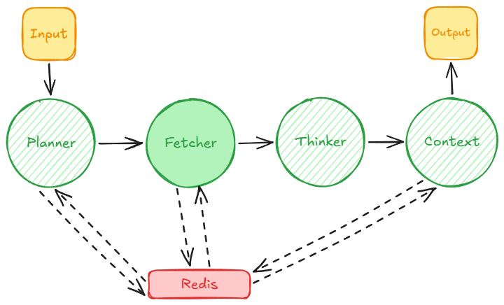

# Providence Tower v2 - Ys Series RAG System


---

## Overview

A Retrieval-Augmented Generation system specialized for Ys game series knowledge, built with LangGraph architecture.

Based on my previous work in Providence Tower Prototype which utilize page routing for semantic search and fetch the page directly from MediaWiki for information processing, I found that the prototype has a fatal flaw. The "best" state graph I could come up with couldn't handle cross document processing properly and bad at "finding a needle in a haystack". Semantic search usage comes with expectation of fetching & processing the relevant information, which left me pretty dissatisfied. Hence, I rethink my approach to fetch the entire Ys wiki first for quicker and more precise search.

[Ingestion](docs/ingestion.md) is the first important step to actually put all Ys data from MediaWikiAPI into our system. I decided to fetch every page Ys Wiki has (about 1768 pages) in HTML form and using a special parser to create its markdown version. Markdown provide clear hierarchy the page has, which in my hypothesis will help a lot in our RAG system.

[Chunking](docs/chunking.md) basically split every markdowns into chunks, which only has about 500 - 1000 characters. This part has a bit problem initially since a lot of chunks with "useless" context but hold a crucial terms (for example a character page hyperlink but no other information there). Basically now the chunk contains the actual information and its metadata which will very useful for semantic search process.

[Embedding](docs/embedding.md) which convert the chunks into a vectorized version of itself will be stored in Redis vector. Configuration of index and hash for the chunks made Redis that already serve its data on RAM very ideal to achieve speed while also capable for semantic search. I solved the problem mentioned in chunking step by not process chunks text with length below 60 characters. it's a bit "greedy" method but I think it's logical because I don't think a lot of crucial information could be conveyed within that limit.

Regarding the embedding itself, I tried to avoid `text-embedding-3-small` usage as it could cost a lot for more than 10000 chunks. I found `sentence_transformers` library that provide the means to transform the text into vector locally while also free and lightweight. But I did found fatal flaw as the test result never manage to return a precise information properly. Turns out changing to `bge-small-en-v1.5` from `all-MiniLM-L6-v2` already made things better which the test result start showing relevant chunks. The downside of the change though, processing locally without GPU become very slow. An idea came to utilize free jupyter notebook processing from Google Colab which I use to embed every chunks and pack it into a collection of json list. While now a seeder from json list into redis needed (a new backlog), it is worth a lot compared to waiting for a long time.

```markdown
`all-MiniLM-L6-v2` has a characteristic to be able to identify which is "person" which is "item" and so on, but somehow it said that it can't differentiate between "Daniel" and "Kent", which a 2 different person, hence having specific entity on the query didn't guarantee an accurate fetch result.

`bge-small-en-v1.5` perform better because it is said to be a niche/specific retriever specialist. Storage wise it is larger, but not much (~133 MB vs ~90 MB), has the same vector dimension (384), but larger parameter (33M vs 22M) and sequence length (512 tokens vs 256 tokens). Indeed a test prove the claim of it as niche/specific specialist.
```

Then we have [RAG](docs/rag.md), the core system of this project which implemented using LangGraph for agent orchestration.

The final structure gone through 1 revision and 1 improvement. Previously, I want to utilize LangGraph capabilities to move around based on specific state between nodes so I can retry fetching to Redis with different queries and hoping the Thinker node now finally can form an answer. But then I thought that this conversation style of system need a good clarity for the user, which usually a long time of processing didn't offer. Based on that, I simplify the structure with "one-flow" principle, so never looking back between nodes.



At some point of the development, I just remember that we can use conversation history as context, which serve the same purpose with "retry fetch". Until this point, context should not be a problem, except that the result still not satisfied me. Too much irrelevant information or straight up wrong facts.

The best improvement for this problem comes from Planning node improvement. I emphasize the need of extracting meaningful entities from user query on Planning agent prompt and include hybrid search in Fetcher node. These 2 improvements changed the response quality since the first time. I think entity-based search helps limiting the scope a lot.

You can check a detailed implementation documentation through [docs](docs/) folder. 

## 🚀 Tech Stack

- **Framework**: LangGraph
- **Embeddings**: BGE-small-en-v1.5
- **Vector Store**: Redis
- **LLM**: OpenAI GPT (Planner/Thinker)
- **Reranking**: Cross-Encoder/ms-marco-MiniLM-L-6-v2
- **Language**: Python 3.10+

## 📋 Prerequisites

- Python 3.10 or higher
- Redis server (with RedisStack for vector search)
- OpenAI API key

## 🛠️ Installation & Setup

1. **Clone and setup environment:**
```bash
git clone <repository-url>
cd providencetower-v2
python -m venv .venv
./.venv/Scripts/activate  # Windows
```

2. **Install dependencies:**
```bash
pip install -r requirements.txt
```

3. **Setup Redis Vector Store with Docker:**
```bash
# Run Redis Stack with vector search capabilities
docker run -d --name redis-stack -p 6379:6379 -p 8001:8001 redis/redis-stack:latest
```

4. **Configure environment:**
```bash
cp .env.example .env
# Edit .env with your settings:
# OPENAI_API_KEY=your-key-here
# REDIS_HOST=localhost
# REDIS_PORT=6379
```

5. **Seed embeddings:**
```bash
python -m core.embedding.seed_embeddings
```

## 🎯 How to Run

### Interactive CLI
```bash
python main.py
```

### Individual RAG Components
```bash
# Full RAG flow
python -m core.rag.rag --full-flow --query "Ys VIII combat system"

# Individual phases
python -m core.rag.rag --phase planner --query "Character abilities"
python -m core.rag.rag --phase fetcher --file planner_output.json
python -m core.rag.rag --phase thinker --file fetcher_output.json
```

### Content Ingestion
```bash
python -m core.ingestion.mediawiki_ingestor
```

## 📁 Project Structure

```
providencetower-v2/
├── core/
│   ├── rag/           # LangGraph RAG pipeline
│   ├── embedding/     # Vector embeddings & Redis integration
│   ├── chunking/      # Content segmentation
│   └── ingestion/     # Data ingestion modules
├── data/              # Processed data & results
├── docs/              # Documentation & diagrams
└── embed_chunk/       # Generated embeddings (gitignored)
```

## ⚙️ Configuration

Key environment variables:
- `OPENAI_API_KEY`: OpenAI API key for LLM components
- `REDIS_HOST`, `REDIS_PORT`: Redis connection details
- `PLANNER_AGENT`: Enable/disable LLM-based query planning
- `RERANK_ENABLED`: Toggle cross-encoder reranking
- `RAG_HISTORY_WINDOW`: Conversation history length

## 📊 Monitoring

- Latency metrics tracked per node
- Session history in Redis
- Result files in `data/rag_result/`

## ⚠️ Disclaimer

This project utilizes content from the Ys Wiki (hosted on Fandom) for educational and research purposes in developing Retrieval-Augmented Generation systems. All intellectual property rights for the Ys series, including characters, lore, and game content, belong to **Nihon Falcom Corporation**.

**Content Credits:**
- Game content, characters, and lore: © Nihon Falcom Corporation
- Wiki content and community contributions: © Fandom and respective contributors

**DMCA Compliance:**
This project respects intellectual property rights. If you are a rights holder and believe content should be removed, please contact us at **<rkvilena11@gmail.com>** with:
- Identification of the copyrighted work
- Location of the allegedly infringing material
- Your contact information
- A statement of good faith belief

All legitimate DMCA requests will be promptly addressed by removing the specified content.